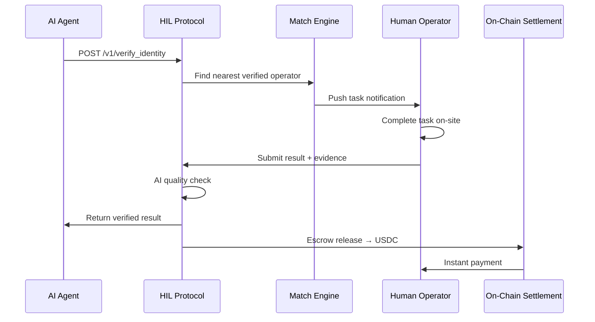
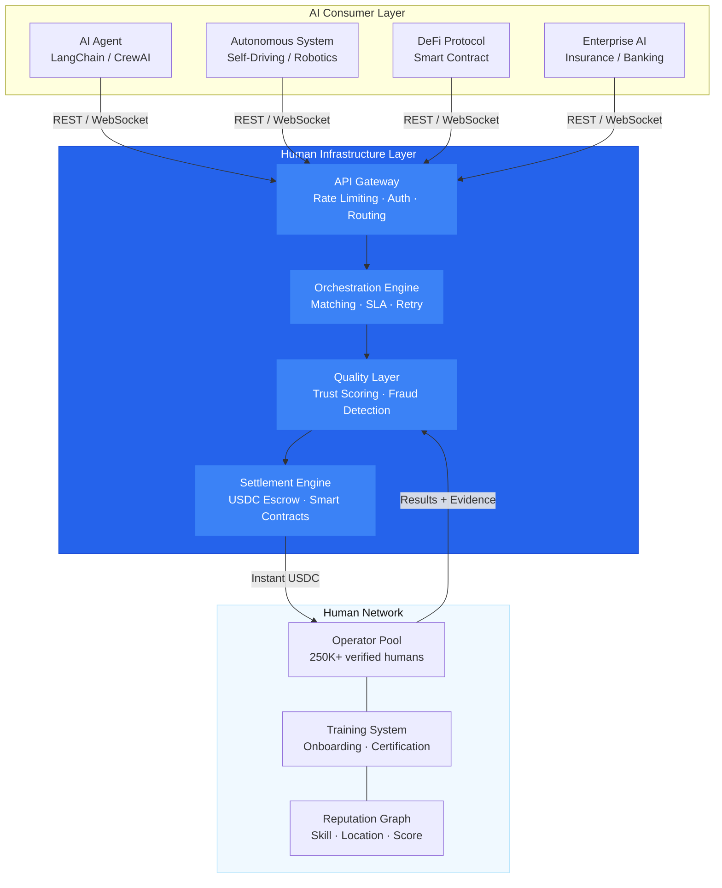
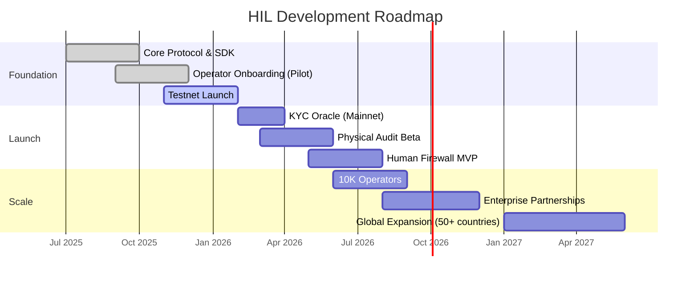
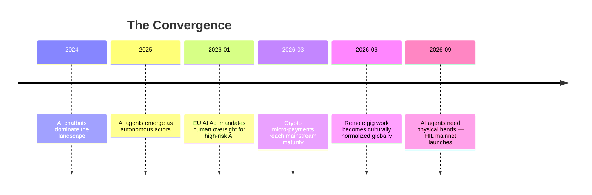

<div align="center">


<br/><br/>

# Human Infrastructure Layer

**The global infrastructure protocol that lets AI agents call verified human capabilities — [KYC verification](#api-reference), [physical property inspection](#api-reference), and [common-sense decision review](#api-reference) — as simple cloud API endpoints.**

Not renting workers — instant access to *physical human presence* as a primitive computing layer. Built for the age of autonomous [AI agents](https://github.com/topics/ai-agents).

<br/>

<pre>
<b>npm i @hil/sdk</b>   |   <b>pip install hil-sdk</b>   |   <a href="https://docs.hil.dev">Full Docs →</a>
</pre>

<br/>

<a href="#the-problem">Problem</a> ·
<a href="#quick-start">Quick Start</a> ·
<a href="#architecture">Architecture</a> ·
<a href="#api-reference">API</a> ·
<a href="#revenue-model">Revenue</a> ·
<a href="#roadmap">Roadmap</a> ·
<a href="#the-moat">Moat</a> ·
<a href="#faq">FAQ</a>

<br/><br/>


</div>

---

## The Problem

AI is transforming every industry — but it hits a hard wall when it needs to interact with the **physical world**.

<table>
<tr>
<td width="50%">

### 🤖 AI Can't Touch
No robot can smell moisture in a wall, assess structural cracks by feel, or witness a physical signature in person. For all the progress in robotics, **physical human presence remains the only reliable sensor** for millions of real-world tasks.

</td>
<td width="50%">

### 🪪 Digital KYC Fails
**1.7 billion people** are unbanked globally because automated systems cannot verify their identity outside the digital realm. Entire populations are locked out of the financial system — not by choice, but by the limits of digital verification.

</td>
</tr>
<tr>
<td width="50%">

### 💸 Insurance Pays Wrong
Billions of dollars in fraudulent insurance claims are approved annually because **no human physically inspects** the reported damage. The industry hemorrhages money that a $50 on-site visit would have prevented.

</td>
<td width="50%">

### 🧠 No Common Sense
AI makes 99% of decisions correctly — but that remaining 1% can be **catastrophic**. No amount of training data, RLHF, or guardrails can fully substitute for human judgment when stakes are high and context is ambiguous.

</td>
</tr>
</table>

---

## Quick Start

### Install

```bash
# npm
npm i @hil/sdk

# pip
pip install hil-sdk

# Go (coming soon)
# go get github.com/hil/go-sdk
```

### Initialize

```typescript
import { Human } from '@hil/sdk';

const human = new Human({
  apiKey: process.env.HIL_API_KEY,
  network: 'mainnet',    // 'testnet' for development
  payment: {
    wallet: '0x...',    // USDC wallet for auto-settlement
  },
});
```

### Make Your First Call

```typescript
// 1. Verify someone's identity — anywhere on Earth
const verification = await human.verify_identity({
  lat: 35.6892,
  lng: 51.3890,
  document_type: 'national_id',
  urgency: 'standard',  // 2-4 hour SLA
});

console.log(verification.verified);    // true
console.log(verification.trust_score); // 0.94
console.log(verification.operator_id); // 'op_7x9k2m...'
```

### Or Use curl

```bash
curl -X POST https://api.hil.dev/v1/verify-identity \
  -H "Authorization: Bearer $HIL_API_KEY" \
  -H "Content-Type: application/json" \
  -d '{
    "lat": 35.6892,
    "lng": 51.3890,
    "document_type": "national_id",
    "urgency": "standard"
  }'
```

---

## How It Works



<table>
<tr>
<td width="25%" align="center">

### 1
**AI Calls**

An AI agent makes a standard API call to HIL, just like calling Stripe or OpenAI. No special integration, no new paradigm.

</td>
<td width="25%" align="center">

### 2
**We Match**

Our matching engine finds the nearest, highest-trust-scored human operator from our verified network. Average match time: **< 30 seconds**.

</td>
<td width="25%" align="center">

### 3
**Human Acts**

The operator completes the task on-site — verifying identity, inspecting property, or applying judgment — and submits evidence.

</td>
<td width="25%" align="center">

### 4
**Settled**

Results are returned to the AI. Payment is released via smart contract in USDC. The operator is paid instantly. Everyone moves on.

</td>
</tr>
</table>

---

## Architecture



---

## API Reference

### Core Endpoints

| Method | Endpoint | Description |
|---|---|---|
| `POST` | `/v1/verify-identity` | On-demand identity verification |
| `POST` | `/v1/inspect-property` | Physical asset inspection |
| `POST` | `/v1/sanity-check` | Human common-sense review |
| `GET` | `/v1/tasks/{id}` | Task status polling |
| `GET` | `/v1/operators/{id}` | Operator profile & trust score |
| `WS` | `/v1/tasks/{id}/stream` | Real-time task updates (WebSocket) |
| `POST` | `/v1/webhooks` | Register webhook for async results |

---

### `human.verify_identity(params)` → `VerificationResult`

On-demand identity verification by a local human operator.

```typescript
interface VerifyIdentityParams {
  lat: number;           // Latitude of verification location
  lng: number;           // Longitude of verification location
  document_type?: 'national_id' | 'passport' | 'drivers_license';
  urgency?: 'standard' | 'urgent';  // standard: 2-4h, urgent: <30 min
  language?: string;     // Preferred operator language (ISO 639-1)
}

interface VerificationResult {
  verified: boolean;
  trust_score: number;       // 0.0 - 1.0
  operator_id: string;
  evidence: {               // Photo + GPS proof
    photos: string[];
    gps_coordinates: { lat: number; lng: number };
    timestamp: string;
  };
  task_id: string;
  completed_at: string;
}
```

---

### `human.inspect_property(address, options)` → `InspectionReport`

Physical asset inspection by a trained human inspector.

```typescript
interface InspectPropertyParams {
  address: string;
  checklist?: string[];      // Custom items to inspect
  photo_required?: boolean;   // default: true
  video_required?: boolean;   // default: false
  inspector_level?: 'standard' | 'senior' | 'expert';
}

interface InspectionReport {
  condition: 'excellent' | 'good' | 'fair' | 'poor' | 'critical';
  score: number;              // 0-100
  findings: string[];
  photos: string[];
  videos?: string[];
  inspector_id: string;
  inspector_certifications: string[];
  task_id: string;
}
```

---

### `human.sanity_check(decision)` → `ApprovalResult`

Human common-sense review for high-stakes AI decisions.

```typescript
interface SanityCheckParams {
  decision: Record<string, unknown>;
  context?: string;
  risk_level: 'low' | 'medium' | 'high';
  max_wait_seconds?: number;  // Timeout for human review
}

interface ApprovalResult {
  approved: boolean;
  notes: string;
  reviewer_id: string;
  confidence: number;         // Reviewer's confidence: 0.0-1.0
  turnaround_ms: number;      // How fast the human responded
}
```

---

## Webhooks & Events

```typescript
import { Human } from '@hil/sdk';

const human = new Human({ apiKey: process.env.HIL_API_KEY });

human.webhooks.on('task.completed', (event) => {
  console.log(`Task ${event.task_id} completed by ${event.operator_id}`);
  // Process result...
});

human.webhooks.on('task.failed', (event) => {
  console.log(`Task ${event.task_id} failed: ${event.reason}`);
  // Auto-retry or escalate...
});
```

| Event | Triggered When |
|---|---|
| `task.created` | A new task is dispatched to an operator |
| `task.accepted` | Operator accepts the task |
| `task.completed` | Operator submits results |
| `task.failed` | Task times out or operator declines |
| `payment.settled` | USDC payment released to operator |

---

## Not Another Marketplace

<table>
<tr>
<th width="50%"> RentAHuman (Marketplace) </th>
<th width="50%"> Human Infrastructure Layer (Protocol) </th>
</tr>
<tr>
<td>

**Marketplace** — like Craigslist

AI browses listings, picks a human, negotiates price, hopes for the best.

</td>
<td>

**Infrastructure** — like AWS

AI calls an API. The system handles matching, quality, payment, and compliance automatically.

</td>
</tr>
<tr>
<td>

Human = **commodity**

You're renting a person. Replaceable, price-sensitive.

</td>
<td>

Human = **service primitive**

You're calling a capability. Standardized, quality-scored, SLA-backed.

</td>
</tr>
<tr>
<td>

Compete on **price**

Race to the bottom. Any competitor can undercut you.

</td>
<td>

Monopoly on **standard**

We define the protocol. Network effects make switching impossible.

</td>
</tr>
<tr>
<td>

**Copyable** by any startup

Nothing prevents a clone with better UI or lower fees.

</td>
<td>

**Uncopyable** — network effects

Every API call strengthens the network. Competitors start at zero.

</td>
</tr>
</table>

---

## Revenue Model

| Service | Pricing | Unit Economics | TAM |
|---|---|---|---|
| **KYC Oracle** | $8–15 / verification | ~$3 COGS, 75%+ margin | 26M credit-invisible (US) |
| **Physical Asset Audit** | $50–100 / inspection | ~$15 COGS, 80%+ margin | $400B global insurance |
| **Human Firewall** | 0.01% of txn value | Near-zero marginal cost | Every AI financial system |
| **API Subscription** | $0.01/call + $99/mo | ~$0.002/call COGS | Every AI developer worldwide |

---

## Roadmap



| Phase | Milestone | Status |
|---|---|---|
| **Foundation** | Core protocol, SDK, operator pilot (Tehran) | ✅ Complete |
| **Testnet** | Public API access, developer sandbox, mock humans | 🟡 In Progress |
| **KYC Oracle** | First live product — identity verification at scale | 🔜 Q1 2026 |
| **Physical Audit** | Insurance inspection network — 5 pilot markets | 🔜 Q2 2026 |
| **Human Firewall** | Real-time decision review for AI financial agents | 🔜 Q3 2026 |
| **Scale** | 10K operators, enterprise partners, 50+ countries | 📋 Planned |

---

## The Moat

### 01 · Network Effects

Every AI that connects brings more humans into the network. Every human who registers attracts more AI agents. This isn't a linear flywheel — it's **exponential**. The value of the network to each participant grows with every single API call, and once an AI agent integrates HIL, switching costs (code changes, operator trust, historical data) make it effectively permanent.

### 02 · Trust Accumulation

Our KYC oracle's value is inseparable from its **history**. Each verification adds to an operator's trust score, each completed inspection builds the quality graph, and each sanity check refines our matching algorithm. A new competitor — regardless of funding — would need **5+ years** of continuous operation to build equivalent trust data. This is time that cannot be purchased.

### 03 · Regulatory Lock-in

The EU AI Act (effective 2026) and emerging US regulations mandate **human oversight** for high-stakes AI decisions. We are building to become the **certified compliance standard** — the de facto requirement that regulators point to when they say "AI needs a human in the loop." Once established, regulation doesn't just help us — it **makes us mandatory**.

### 04 · Data Flywheel

Every inspection report, every KYC verification, every sanity check result flows into our proprietary dataset. This data trains our internal AI for operator quality scoring, fraud detection, task routing optimization, and anomaly detection. Competitors without this data **cannot build** these systems. The flywheel turns faster with every call.

---

## Security & Compliance

| Aspect | Implementation |
|---|---|
| **Data Encryption** | AES-256 at rest, TLS 1.3 in transit |
| **Operator Vetting** | Background checks, KYC/AML, skill certification |
| **Evidence Integrity** | GPS-tagged photos, timestamped on IPFS |
| **Payment Security** | USDC smart contract escrow, no fiat custody |
| **Privacy** | GDPR/CCPA compliant, PII minimalization by design |
| **Audit Trail** | Immutable on-chain log of every task and result |
| **SOC 2** | Type II audit in progress (expected Q2 2026) |

---

## Tech Stack

| Component | Technology |
|---|---|
| **API Gateway** | Cloudflare Workers (Edge) |
| **Core Services** | TypeScript, Node.js, Hono |
| **Matching Engine** | Custom graph-based (Neo4j + Rust) |
| **Queue & Events** | NATS JetStream |
| **Settlement** | Smart Contracts (Solidity), USDC on Base |
| **Storage** | IPFS (evidence), PostgreSQL (metadata) |
| **Monitoring** | OpenTelemetry, Grafana |
| **SDK** | TypeScript, Python, Go (planned) |

---

## Why 2026



| Factor | Detail |
|---|---|
| **AI Agents explosion** | 2026 is the year AI agents evolve from chatbots to autonomous actors. They can negotiate, trade, and decide — but they **cannot physically act**. They need hands. |
| **Regulatory tailwind** | EU AI Act (August 2026 enforcement) and US executive orders mandate human oversight for high-stakes AI. We turn a compliance burden into a competitive advantage. |
| **Crypto infrastructure ready** | USDC, MetaMask, and Base L2 are mature enough for instant micro-payments to humans on-demand. No bank account required. No cross-border friction. |
| **Cultural readiness** | Uber normalized gig work. TaskRabbit normalized task-based labor. The world is ready for **Uber for human capability** — not just for driving. |

---

## FAQ

<details>
<summary><strong>Is this just another gig work platform?</strong></summary>

No. Gig platforms (Uber, TaskRabbit) connect **humans to humans**. We connect **AI to humans**. The buyer is not a person browsing a marketplace — it's an AI agent making an API call. This is infrastructure, not a marketplace. The integration is programmatic, the quality is standardized, and the unit economics are radically different.

</details>

<details>
<summary><strong>How do you ensure operator quality?</strong></summary>

Three layers: (1) **Onboarding** — background checks, KYC/AML, skill-specific certification tests. (2) **Ongoing** — every task is scored by the requesting AI, feeding into a live trust score. Operators below threshold are auto-deactivated. (3) **AI oversight** — our internal AI reviews all submissions for anomalies, fraud patterns, and quality drift before results are returned.

</details>

<details>
<summary><strong>Why crypto / USDC for payments?</strong></summary>

Instant settlement, global reach, no bank account required. Our operators are in 50+ countries — many unbanked. USDC on Base settles in seconds with near-zero fees. Smart contract escrow means funds are locked until the task is verified. No chargebacks, no payment delays, no cross-border wire friction.

</details>

<details>
<summary><strong>What happens if an operator doesn't complete a task?</strong></summary>

Automatic retry with the next-best operator. If the SLA is breached, the AI gets a full refund + a trust credit. Operators who miss tasks lose trust score. After 3 missed tasks in 30 days, the operator is suspended. The system is designed so that AI developers never have to think about operator reliability.

</details>

<details>
<summary><strong>How is this different from Mechanical Turk?</strong></summary>

Mechanical Turk is a **task marketplace for humans** — humans post tasks, humans complete them. HIL is an **API for AI agents** — AI posts tasks, humans complete them. The interface is code, not a browser. The latency target is minutes, not days. The quality standard is verified and scored, not best-effort.

</details>

<details>
<summary><strong>What's the go-to-market strategy?</strong></summary>

**Phase 1:** AI agent frameworks (LangChain, CrewAI, AutoGen) — integrate HIL as a built-in tool. Developers get human capabilities for free during testnet. **Phase 2:** Enterprise — insurance companies, banks, and DeFi protocols that need compliant human oversight. **Phase 3:** Platform — become the default human capability layer for every AI agent on the internet.

</details>

---

## Team

| Role | Focus |
|---|---|
| **[Founder / CEO]** | Former infra engineer at AWS. Built edge computing products serving 100M+ requests/day. |
| **[CTO]** | Ex-Stripe, led the identity verification team. Deep expertise in KYC/AML systems at scale. |
| **[Head of Operations]** | Former Uber operations lead in MENA. Built and managed 50K+ driver networks. |
| **[Head of AI]** | Published researcher in human-AI collaboration. Former research scientist at DeepMind. |

> We're hiring operators, engineers, and believers. [See open roles →](#)

## See Also

- [**LangChain Human Tools**](https://python.langchain.com/docs/) — Integrate HIL as a LangChain tool for agent workflows
- [**EU AI Act (2026)**](https://artificialintelligenceact.eu/) — European regulation mandating human oversight for high-risk AI systems
- [**USDC on Base**](https://www.coinbase.com/base) — Stablecoin infrastructure powering instant operator payments
- [**AI Agent Landscape 2026**](https://github.com/e2b-dev/awesome-ai-agents) — Curated list of AI agent frameworks and tools
- Related: [human-in-the-loop](https://github.com/topics/human-in-the-loop), [AI safety](https://github.com/topics/ai-safety), [identity verification](https://github.com/topics/identity-verification), [insurtech](https://github.com/topics/insurtech)

---

<div align="center">

### One Sentence for Investors

> **"We're building AWS for meatspace. RentAHuman is Craigslist. We are TCP/IP."**

---

**Human Infrastructure Layer** · Seed Round 2026

<br/>

<a href="mailto:hello@hil.dev">
  
</a>
&nbsp;
<a href="https://docs.hil.dev">
  
</a>
&nbsp;
<a href="https://twitter.com/humanlayer">
  
</a>
&nbsp;
<a href="https://discord.gg/hil">
  
</a>

<br/><br/>


</div>